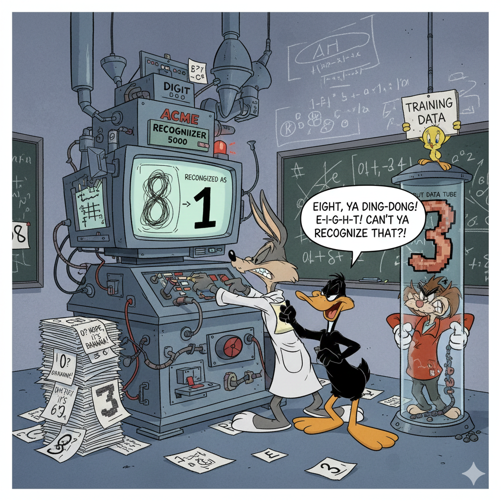

  

---

# Kaggle_DigitRecognizer

## Convolutional Neural Networks (CNNs) for Image Recognition

Convolutional Neural Networks (CNNs) are a class of deep neural networks that have proven highly effective for tasks involving image data, including digit recognition. They are specifically designed to automatically learn spatial hierarchies of features directly from the pixel data.

### Core Concepts of CNNs

- **Convolutional Layers:** These are the building blocks of CNNs. They consist of learnable filters (or kernels) that slide over the input image, performing a dot product between the filter and a small patch of the image. This operation produces a "feature map" that highlights specific features (e.g., edges, corners, textures) present in the image. Multiple filters are typically used in each convolutional layer to extract diverse features.

- **Activation Functions:** After each convolution operation, a non-linear activation function (such as ReLU - Rectified Linear Unit) is applied to the feature map. This introduces non-linearity into the model, allowing it to learn complex patterns.

- **Pooling Layers:** These layers are used to reduce the spatial dimensions (width and height) of the feature maps, which helps to decrease the number of parameters and computations in the network. Common pooling operations include Max Pooling (selecting the maximum value in a local region) and Average Pooling (calculating the average value). Pooling also contributes to making the model more invariant to small translations, rotations, and scaling of the input.

- **Fully Connected Layers:** After several convolutional and pooling layers, the high-level features extracted by these layers are fed into one or more fully connected layers. These layers perform the final classification by learning non-linear combinations of these features.

- **Output Layer:** The final fully connected layer typically has a number of neurons equal to the number of classes (10 for digit recognition). An activation function like Softmax is used in the output layer to produce a probability distribution over the classes, indicating the model's confidence in each digit.

### Why CNNs are Effective for Digit Recognition

- **Hierarchical Feature Learning:** CNNs automatically learn features at different levels of abstraction. Early layers detect simple features like edges and curves, while deeper layers combine these to recognize more complex shapes and ultimately the digits themselves.
- **Spatial Invariance:** Pooling layers help the model become more robust to small variations in the position and orientation of the digits.
- **Parameter Sharing:** Convolutional layers use the same filters across different parts of the image, which significantly reduces the number of learnable parameters compared to fully connected networks, making them less prone to overfitting and more efficient to train.

## Vision Transformer (ViT)

The Vision Transformer (ViT) is a transformer-based architecture designed for image classification tasks. It applies the transformer model, originally developed for NLP, to image data by splitting images into patches and treating them as sequences.

### Key Features of ViT

- **Patch Embedding**: Images are divided into fixed-size patches, which are flattened and linearly embedded.
- **Self-Attention Mechanism**: Captures global dependencies between patches, enabling the model to focus on important regions of the image.
- **Pretraining**: Pretrained on large datasets like ImageNet, ViT achieves state-of-the-art performance on image classification tasks.
- **Scalability**: Available in configurations like `ViT-Base`, `ViT-Large`, and `ViT-Huge`.

### How It Works

1. **Patch Extraction**: The input image is divided into non-overlapping patches.
2. **Linear Projection**: Each patch is flattened and projected into a fixed-dimensional embedding space.
3. **Transformer Encoder**: The sequence of patch embeddings is passed through a standard transformer encoder.
4. **Classification Head**: A special classification token is appended to the sequence, and its representation is used for classification.

### Applications

- Handwritten digit recognition (e.g., MNIST dataset).
- General image classification tasks.
- Transfer learning for domain-specific datasets.

### References

- [Original ViT Paper](https://arxiv.org/abs/2010.11929)
- [Hugging Face ViT Documentation](https://huggingface.co/docs/transformers/model_doc/vit)

### How to use it?

For pre-trained ViT and its variants, check out [Hugging Face ViT Documentation](https://huggingface.co/docs/transformers/model_doc/vit)